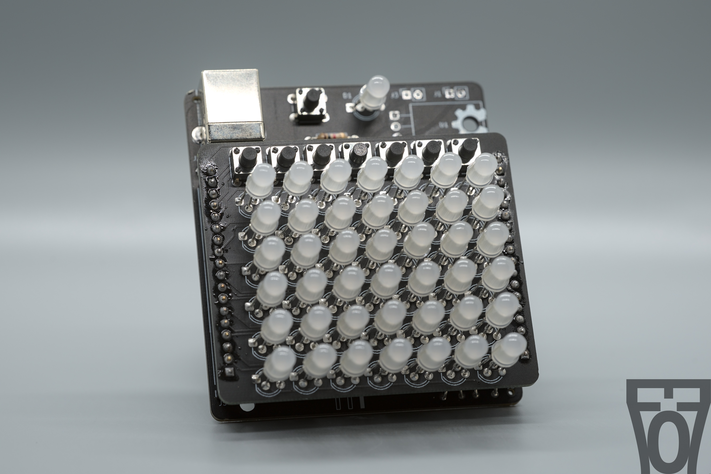
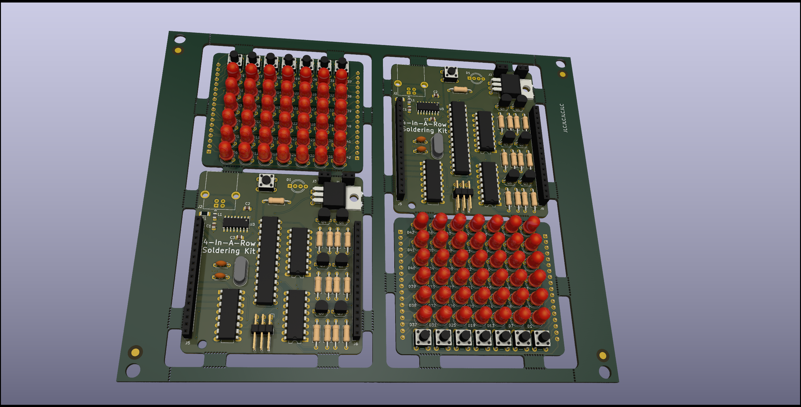

# PCB Digital 4-In-A-Row

This a PCB is a soldering kit for a 4-In-A-Row game. A simple game consisting of 2 boards: one for the driver and one for the LEDs.

## Kits Page
The dedicated webpage for this can be found at [https://kits.electro707.com/4_in_a_row/](https://kits.electro707.com/4_in_a_row/)

## Kit on Tindie
I am currently selling the kit on Tindie. The product page can be found at [https://www.tindie.com/products/28121/](https://www.tindie.com/products/28121/).

## Firmware
The firmware can be found in the [Firmware](Firmware) folder. To build and upload the program, see [FIRMWARE.md](FIRMWARE.md) for more details.

## License
This project is licensed under the MIT license. See the [LICENSE.md](LICENSE.md) file for details.
TL;DR: You can download and modify the project as you wish. I simply ask you publish your fork or try and merge back to this repo (even thought you are under no obligations to do so).

## Changelog 
See [CHANGELOG.md](CHANGELOG.md) for changes info.

## Previous/Archived Repo
This project used to be in another repo before I archived it. The reason for the archive is I wanted to start properly using git as a version manager (instead of different folders) as well as a project cleanup. Think of it as a new start to this project.
The previous project repo can be found here: [https://github.com/Electro707/PCB-4-In-A-Row-ARCHIVE](https://github.com/Electro707/PCB-4-In-A-Row-ARCHIVE)

## Other Images

With Panel (not actually updated, just made it once):

